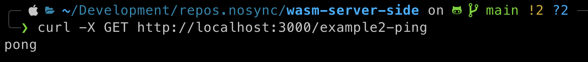
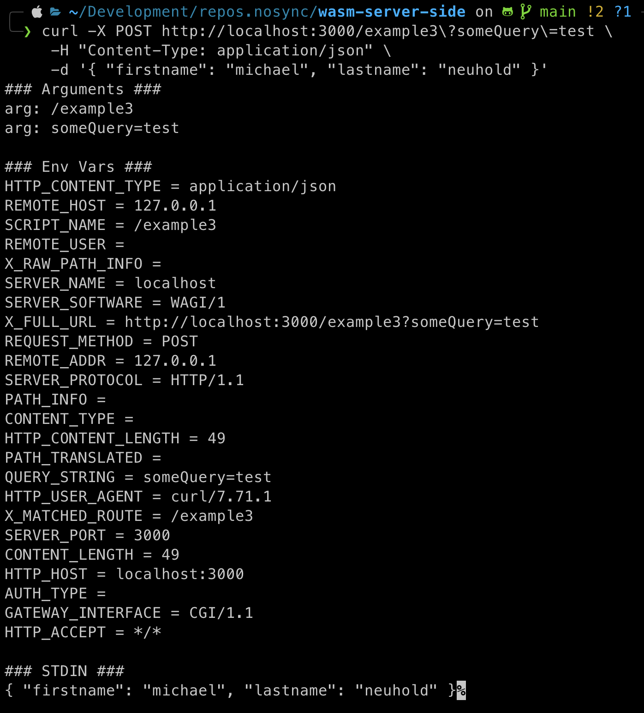
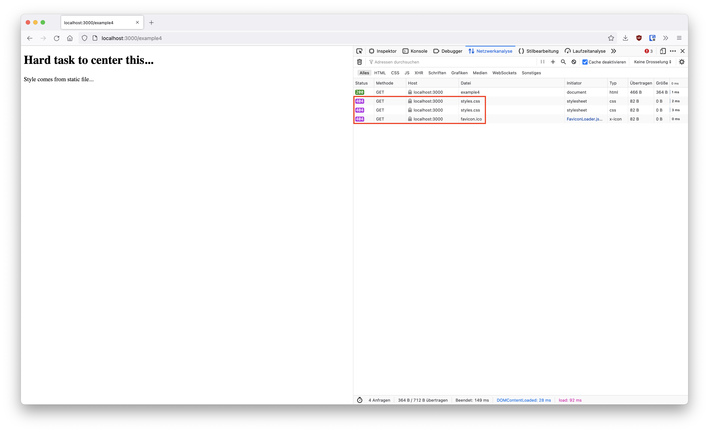
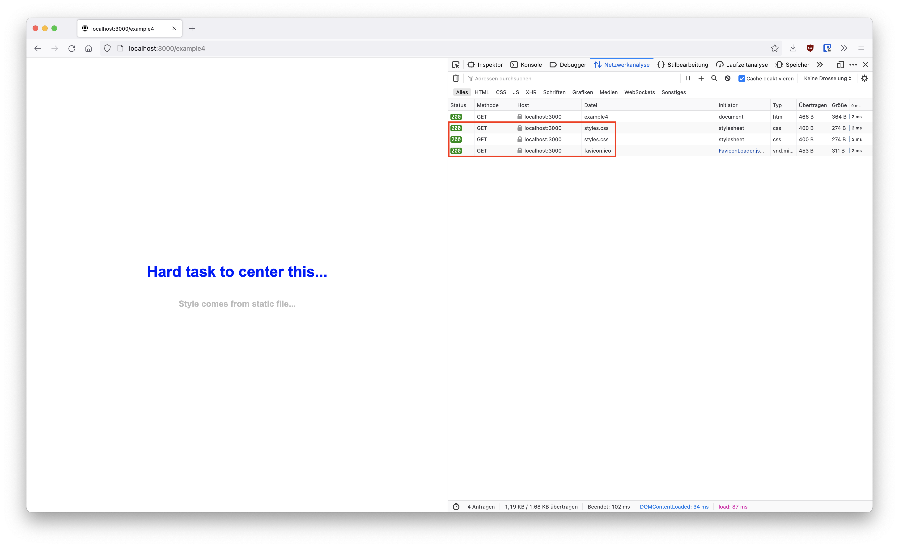

# Building server-side services with WebAssembly
This repository is about playing around with WebAssembly on the server-side. Testing the concept of sandboxed wasm applications and there similarity to containers. The examples are based on the resources below and will be extended incrementally.
- https://github.com/rstropek/rust-samples/tree/master/hello-wagi
- https://slides.com/rainerstropek/wasm-container-killer/fullscreen
- Awesome talk: https://www.youtube.com/watch?v=Xumf_n2KlBM


## wasm
WebAssembly (abbreviated Wasm) is a binary instruction format for a stack-based virtual machine. Wasm is designed as a portable compilation target for programming languages, enabling deployment on the web for client and server applications. ([Reference](https://webassembly.org/))

## wasmtime
A fast and secure runtime for WebAssembly. ([Reference](https://wasmtime.dev/))

## wasi
WASI is a modular system interface for WebAssembly. As described in the [initial announcement](https://hacks.mozilla.org/2019/03/standardizing-wasi-a-webassembly-system-interface/), it’s focused on security and portability. ([Reference](https://wasi.dev/))

## wagi
WAGI allows you to run WebAssembly WASI binaries as HTTP handlers. Write a "command line" application that prints a few headers, and compile it to WASM32-WASI. Add an entry to the modules.toml matching URL to WASM module. That's it. ([Reference](https://github.com/deislabs/wagi))

## general
All examples are implemented in Rust. However, no language-specific knowledge is necessary to understand the code snippets. To execute more complex shell commands the [justfile project](https://github.com/casey/just) was used.

## Run wasm outside the Browser 
[Package](./example1)

Just start by implementing a `Hello World` program written in Rust. The code can be found [here](./example1/src/main.rs). To build the project with `cargo`, execute the following command:
````SHELL
just example1-build
````
To run the generated executable run the following command:
````SHELL
just example1-run
````
The same code can be compiled to `wasi`. Therefore the target of `cargo build` has to be set to `--target wasm32-wasi`. Furthermore it is possible to execute it via the `wasmtime` runtime. Just run the following command:
````SHELL
just example1-with-wasmtime
````
All commands are specified in [justfile](./justfile).

## Wagi http request handler 
[Package](./example2)

The next examples use `watchexec` which simply recompiles the source code when it is updated. For this example to run, a `modules.toml` file has to be created. For that example it is enough to add the following lines to the file:
````TOML
[[module]]
route = "/example2-ping"
module = "./target/wasm32-wasi/debug/example2.wasm" 
````
Wagi is an CGI (Common Gateway Interface) implementation for WebAssembly. The specified module is served as http handler at `/example2-ping`. The handler runs sandboxed (eg. handler does not have access to other files on the host and only limited access to environment variables).

The example 2 code just writes the raw format of an HTTP response on standard out.
````RUST
fn main() {
    println!("Content-Type: text/plain");
    println!(); // separates header and body
    println!("pong")
}
````
````SHELL
just watch example2
````

````SHELL
curl -X GET http://localhost:3000/example2-ping \
     -H "Content-Type: text/plain"
````



## Advanced http request handler 
[Package](./example3)

The third example shows what happens to the header, query string and body of a POST request. The code can be found [here](./example3/src/main.rs).
````SHELL
just watch example3
````

````SHELL
curl -X POST http://localhost:3000/example3?someQuery=test \
     -H "Content-Type: application/json" \
     -d '{ "firstname": "michael", "lastname": "neuhold" }'
````



## Access to static files
[Package](./example4)

This example shows how to provide access to static files inside the sandbox. Therefore, the rust [code](./example4/src/main.rs) used returns HTML that links to a static `styles.css` file. Without explicitly providing the static folder, the sandbox cannot access this file. 
````SHELL
just watch example4
````



In `modules.toml`, access can be set up by binding the static folder to the sandbox, which is similar to Docker's volume binding.
````TOML
[[module]]
route = "/static/..."
module = "./fileserver.gr.wasm"
volumes = {"/" = "/Users/michaelneuhold/Development/repos.nosync/wasm-server-side/_static"}
````
Now the `styles.css` and `favicon.ico` can be loaded.


## Allow request to other host
[Package](./example5)

TODO
````SHELL
just watch example5
````